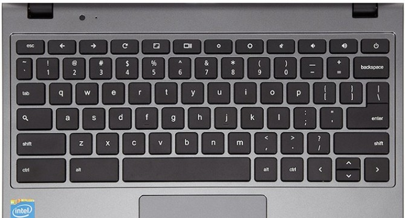

## 动机

大写锁定键是我的键盘上用的最少的键之一。说是之一，一是因为我的键盘上还有一个关机键使用频率和它有的一拼，二是由于其地理位置优越经常会被误按。

实际上，在Chromebook上，大写锁定键就被Google换成了更为常用的“搜索键”；另外，也有vimer把大写锁定键用作ESC键，效果拔群。

根据个人习惯，我最终决定将大写锁定键更改为输入法切换键，一是因为作为一个中国人输入法切换是使用最多的一个快捷键之一；另一个原因是因为如此一来键上的指示灯还可作为输入法指示灯，简直完美。

## 更改键绑定

- 打开**系统偏好设置－键盘－键盘－修饰键**，将Caps Lock键设为“无操作”
- 下载[Seil](https://pqrs.org/osx/karabiner/seil.html.en)（良心软件，良心作者），打开后将Caps Lock键映射为Key Code 80（或者其他一个不存在的键，80代表`F19`）
- 打开**系统偏好设置－键盘－快捷键－输入源**，将切换输入法的快捷键设置为`F19`（通过选择后按一下Caps Lock）

Done! 但是现在问题来了：大写锁定的灯永远不亮，这不优美！我们希望指示灯也更改为能够指示输入法状态，即在英文状态下不亮，在拼音/五笔等输入法状态下亮。经过Google发现，OS X提供了控制键盘灯的底层API，可以手动控制其状态，详见[MacLight](https://github.com/busyloop/maclight)。这就好办了，于是我依次尝试了以下几种解决方案：

- 写一段Shell脚本来切换输入法（通过Applescript模拟Keystroke）＋切换指示灯状态，通过Automator新建一个“服务”然后将大写锁定键绑定为运行该脚本。但是经过测试发现延时太大（`~200ms`），放弃。
- 用Objective-C写一个调用底层API的程序来切换输入法（通过`TISSelectInputSource`系列API）＋切换指示灯状态，发现调用API切换输入法后需要切换到下一个输入窗口才会生效，并且延时依然很大，放弃。
- 用Objective-C写一个后台应用，通过`NSDistributedNotificationCenter`接收输入法变更事件，根据状态改变指示灯。科学！

最终采用了最后这种科学的方法。当然，这个后台应用只需要是命令行应用就可以了，通过`launchctl`等方式开机自动启动即可。不过由于强迫症什么的（方便启动、退出，方便加为登录启动项）还是写成了占领在状态栏的应用，并取名为`IMLight`，如下图：

下载链接：[点我](http://cl.ly/2s3P2E1x2A2k) or [Fork me at GitHub](https://github.com/blahgeek/IMLight)
