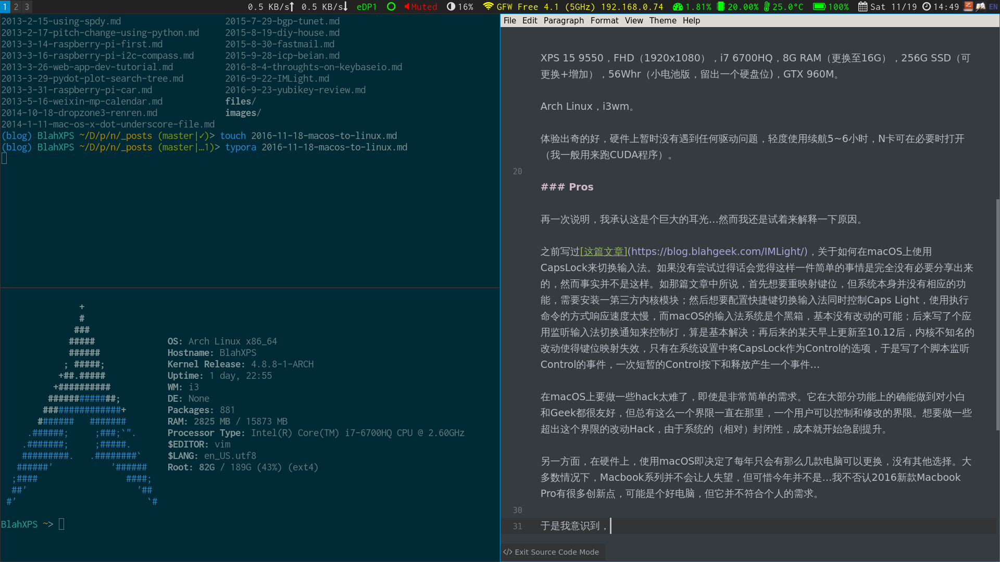

几周前玩儿法的Frank还联系我说希望持续转载博客上macOS相关的内容来着，我还满口答应并表示会多分享macOS内容，然而…**啪啪啪啪啪**；三年前，[从Linux到Mac OS X](https://blog.blahgeek.com/cong-linuxdao-mac-os-x.html)，[话说Mac OS X如何同时做到对小白和Geek友好](https://blog.blahgeek.com/hua-shuo-mac-os-xru-he-tong-shi-zuo-dao-dui-xiao-bai-he-geekyou-hao.html)，然而…**啪啪啪啪啪**。这个耳光是如此的响亮，以至于我在更换了Linux两周后才下定决心记录一下这个过程…

总之呢，`之前的Macbook需要更换`+`Apple发布了无Esc无USB Type-A键盘键程短涨价40%的Macbook Pro`+`XPS是个好电脑`=`从macOS到Linux，从Macbook到XPS`。

XPS 15 9550，FHD（1920x1080），i7 6700HQ，8G RAM（更换至16G），256G SSD（可更换+增加），56Whr（小电池版，留出一个硬盘位)，GTX 960M。

Arch Linux，i3wm。

体验出奇的好，硬件上暂时没有遇到任何驱动问题，轻度使用续航5~6小时，N卡可在必要时打开（我一般用来跑CUDA程序）。

### Pros

再一次说明，我承认这是个巨大的耳光…然而我还是试着来解释一下原因。

之前写过[这篇文章](https://blog.blahgeek.com/IMLight/)，关于如何在macOS上使用CapsLock来切换输入法。如果没有尝试过得话会觉得这样一件简单的事情是完全没有必要分享出来的，然而事实并不是这样。如那篇文章中所说，首先想要重映射键位，但系统本身并没有相应的功能，需要安装一第三方内核模块；然后想要配置快捷键切换输入法同时控制Caps Light，使用执行命令的方式响应速度太慢，而macOS的输入法系统是个黑箱，基本没有改动的可能；后来写了个应用监听输入法切换通知来控制灯，算是基本解决；再后来的某天早上更新至10.12后，内核不知名的改动使得键位映射失效，只有在系统设置中将CapsLock作为Control的选项，于是写了个脚本监听Control的事件，一次短暂的Control按下和释放产生一个事件…

类似的事情还有很多：比如想要配置本地DNS Server，但占用53端口后会影响自带的Internet Sharing功能；想要体验Tiling Window Manager，能做的只是在系统自带的窗口管理系统上想办法尽可能的模仿，抑或是祈祷下一次WWDC的“惊喜”；想要把状态栏变得“干净”一点，恩可以下个$15的应用帮我做这件事情，对了还顺便需要关闭SIP……

在macOS上要做一些hack太难了，即使是非常简单的需求。它在大部分功能上的确能做到对小白和Geek都很友好，但总有这么一个界限一直在那里，一个用户可以控制和修改的界限。想要做一些超出这个界限的改动Hack，由于系统的（相对）封闭性，成本就开始急剧提升。

另一方面，在硬件上，使用macOS即决定了每年只会有那么几款电脑可以更换，没有其他选择。大多数情况下，Macbook系列并不会让人失望，但可惜今年并不是…我不否认2016新款Macbook Pro有很多创新点，可能是个好电脑，但它并不符合个人的需求。

于是我意识到，使用macOS就是个坑，一个华丽的大坑。这个坑也许可以提供你90%的需求，也有可能可以提供你99%的需求，但剩下部分的自由终归无法提供给你；更可怕的是，这个坑可以提供的事情完全取决于Apple，一个普通用户只会越陷越深。所以我决定逃离，趁着还没有太晚。

### Cons

出乎意料的，与三年前从Linux到Mac OS X不同，这次从macOS到Linux之后我最怀念的并不是当初那些拥抱Mac OS X的理由，而是一些别的东西。

这次从macOS到Linux，我最怀念的是macOS上一些精巧的小工具，比如：

- [LaunchBar](https://www.obdev.at/products/launchbar/index.html)
- [Dropzone 3](https://aptonic.com/)
- [Dash](https://kapeli.com/dash)
- [Dropshelf](https://pilotmoon.com/dropshelf/)
- ……

其中有一些可以有（比较弱的）代替版本，比如LaunchBar（rofi+自己写脚本）、Dash（[Zeal](https://zealdocs.org/)），而另一些则很难代替。不过好在Linux有着足够的自由度，可以使用其他几乎任何自己可以想到的功能代替，所以当使用习惯迁移过来之后也没有很大的问题。

另一方面，之前保存在Apple生态之中的各种数据，比如音乐、照片、备忘录等，在Linux下访问他们也是一个问题，不过这本身也是一个迟早需要跳出来的坑，晚做不如早做。

三年前提到的关于各种应用（如社交类）的丰富程度依然还是个问题，不过很幸运的是这三年间移动应用发展迅速，大部分这类需求已经完全可以在手机上完成，对电脑的需求反而降低了，所以这个问题又似乎变得没那么严重了。

### End

恩，最后，Arch大法好。

> 从Linux到macOS，从macOS到Linux，城外的人想冲进去，城里的人想逃出来…然而有一件事情是亘古不变的，那就是：永远不会想用Windows。